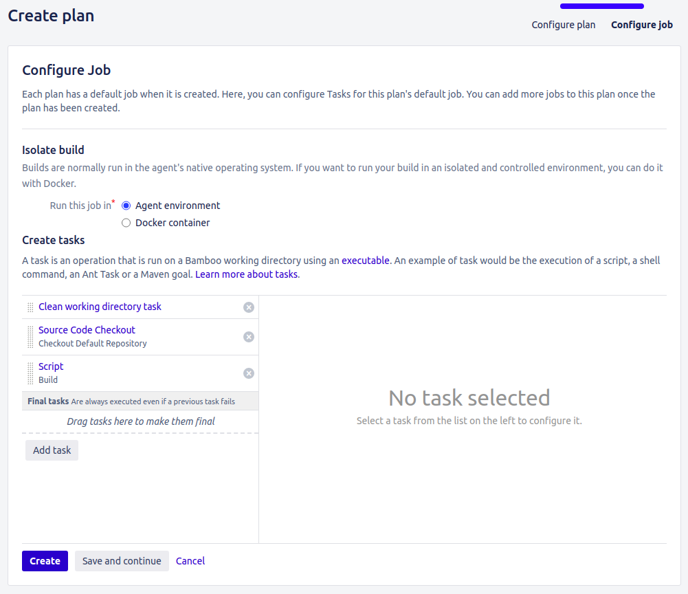
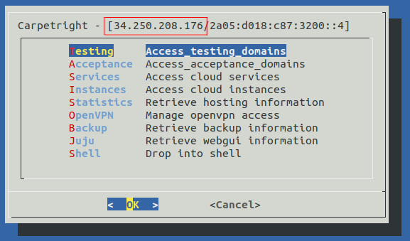
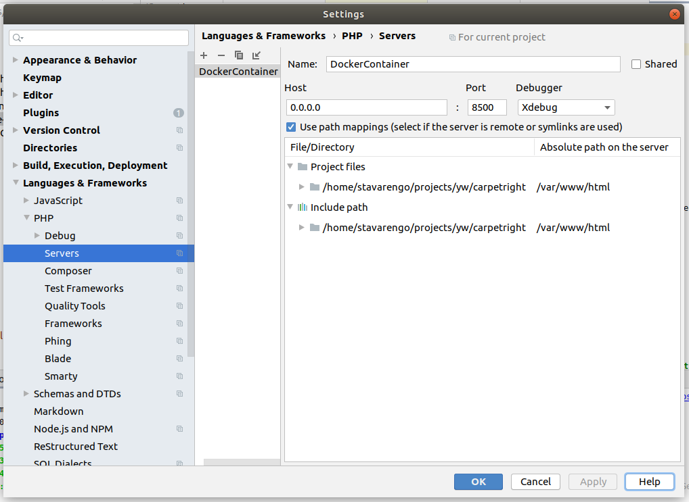

# pimcore-skeleton

This is a skeleton repository for any new Pimcore projects we got. This repository is intended to help you start new 
Pimcore projects faster. After you get your project running with this skeleton, you can change the code anyway you 
want. This project is not intended to create rules/standards on how you should code or do your work. This is just a 
skeleton project.

**If you find any mistake or if anything that does not work exactly how this README says it should work, please create
an issue or submit a PR with the fix.**

**What is the scope of this repository?**

- Contains only the inevitable work that needs to be done for any new Pimcore project, no matter what the project is 
  going to be. This means: 
    - Pimcore 6 standard skeleton installation.
    - Docker environment for development with Xdebug.
    - Scripts for Bamboo integration following the standards defined by 
      [Youwe Deployer](https://source.youwe.nl/projects/DEPLOYMENT/repos/deployer/browse) and 
      [Youwe Pimcore Deployer](https://source.youwe.nl/projects/DEPLOYMENT/repos/deployer-pimcore).
- Provide instructions about how to:
    - Configure Bamboo for build and deploy your project into Test, UAT and Production environments.
    - Debug your code using PHPStorm, Xdebug and our Docker environment.
    - Setup a local Apache Virtual Host for those who don't want to code with Docker.

**What is NOT the scope of this repository?**

- Create and/or define code standards. You, as a developer, are free to change anything you want when using this 
  skeleton in your new project.
- Any work that would not necessarily be part of all the Pimcore 6 projects, should not be in this skeleton.

## What comes with this skeleton?

- Pimcore 6 standard skeleton installation.
- Docker environment for development with Xdebug.
- [Youwe Deployer](https://source.youwe.nl/projects/DEPLOYMENT/repos/deployer/browse) and 
  [Youwe Pimcore Deployer](https://source.youwe.nl/projects/DEPLOYMENT/repos/deployer-pimcore) for integration with 
  Bamboo.
- Instruction (below in this file) about how to configure Bamboo, debug code running inside a Docker Container and 
  to setup a local Apache virtual host.

## How to use it? (Installation)

1. Fork or download this skeleton source code **(do not clone it)**.
1. Run the following code (Requires Docker 17.09 or newer):
   ```bash
   $ docker-compose up
   ```
1. Access the application (first access can take a long time to load) at [http://0.0.0.0:8500](http://0.0.0.0:8500).   
   To login use username `admin` and password `admin`.
1. Optionally, follow [these instructions](#configure-phpstorm-debugging) to configure PHPStorm Path Mapping for
   debugging tools.
1. Setup the Bamboo deployment: [follow these instructions](#youwe-deployment).

> **About our Docker Environment!** [Read this](#docker-environment) if you want to know what you get out-of-the-box 
> when using our `docker-compose.yml`.

> **Apache Virtual Host Setup!** If you don't use Docker Compose or if you prefer to work without Docker, follow the 
> [Apache Setup: Installation without Docker](#installation-without-docker).

<a id="youwe-deployment" name="youwe-deployment"></a>
## Youwe Deployment: CI/CD With Bamboo

For a full integration with Bamboo, your project needs two branches: `master` and `develop`. When you push to `develop`
you a new version is deployed to _Testing_ and _Acceptance_ environments. When you push to `master` a new version is 
deployed to the _Production_ environment. First, lets configure both these branches in your repository.

1. Go to [Bitbucket Create Branch Service](https://source.youwe.nl/plugins/servlet/create-branch) and fill the inputs
   as follow:
    - **Repository:** Select your repository.
    - **Branch type:** Custom
    - **Branch from:** master
    - **Branch name:** develop
1. Click on `Create branch`.
1. Optional: Change default branch from `master` to `develop`.
    1. Open the repository settings (eg: https://source.youwe.nl/projects/`_PROJECT_KEY_`/repos/`_REPOSITORY_NAME_`/settings).
    1. Change the option **Default branch** to `develop`.
    1. Click `Save`.

### Bamboo Setup

To configure Bamboo to deploy your application to one of the Youwe servers, you must create a _Bamboo Build Plan_ and a
_Bamboo Deploy Plan_. Follow the step-by-step tutorial below to properly setup a CI/CD environment for your project.

<a id="bamboo-create-build-plan" name="bamboo-create-build-plan"></a>
#### Create the Build Plan
1. Go to Bamboo and click on [Create a Project](https://ci.youwe.nl/project/newProject.action).
   > You don't need to create it again if you are creating or second Build Plan.
1. After the project is created, click on [Create plan](https://ci.youwe.nl/build/admin/create/newPlan.action) and fill
   the inputs as follows.
    1. **Project:** Select the project you created in the first step.
    1. **Plan Name:** Build from Develop Branch
    1. **Plan Key:** BFDB.
    1. **Plan description:** Build from develop branch and deploy to both Testing and Acceptance environments.
    1. **Repository host:** Select `Link new repository`.
    1. Choose `Bitbucket Server / Stash` and fill the rest of inputs as follow:
        1. **Display name:** Repeat your repository name.
        1. **Server:** Bitbucket
        1. **Repository:** Select your repository.
        1. **Branch:** develop
           > Select the branch `master` If you are creating a Build Plan for Production. 
1. Click on the button `Configure Plan`.
    1. Select the task `Source Code Checkout` and make sure the correct repository is selected; then click on `Save`.
    1. Add the task `Clean working directory`.   
       Click on `Save`.   
       Drag it to be in the first position.
    1. Add the task `Script` and fulfill the fields has follow:
        - **Task description**: Build
        - **Interpreter**: Shell
        - **Script location**: File
        - **Script file**: build/deployer/build.sh
        - **Argument**: build
    1. Click on `Save`
    1. Click on `Save and continue` (Don't click on `Create`).
    1. This is what the tasks should look like.   
    
1. Click on "Default Job".
    1. Select the "Requirements" tab.
        1. On the field "Search for a capability", select PHP7.2.
        1. Select "exists" on the next field.
        1. Click on `Add`.
    1. Select the "Artifacts" tab.
        1. Click on `Create artifact`.
        1. Fulfill the fields with the following data:   
           **Name:** Build Artifacts   
           **Location:** build   
           **Copy pattern:** `**/*`   
           **Shared:** `true`   
           **Required:** `true`
        1. Click on `Create`.

<a id="bamboo-create-deploy-plan" name="bamboo-create-deploy-plan"></a>
#### Create the Deployment Plan

1. Go to Bamboo and click on [Create deployment project](https://ci.youwe.nl/deploy/config/newDeploymentProjectDetails.action).
   > You don't need to create it again if you are just repeating the steps to deploy into another environment.
    1. Fulfill the fields with the following data:   
       **Name:** Testing   
       **Description:** Deploy to Testing environment   
       **Build plan:** Select the build plan called `Build from Develop Branch` that we created on the 
       [previous chapter](#bamboo-create-build-plan).
    1. Click on `Create deployment project`.
1. Click on `Add environment`. 
    1. Fulfill the fields with the following data:   
       **Environment details:** Testing   
       **Deploy release in:** Agent environment
    1. Click on `Create`.
1. Click on `Set up tasks`.
    1. Select the task "Artifact download".
        1. Change the following fields:   
           **Artifact name:** All artifacts   
           **Destination path:** build
        1. Click on `Save`.
    1. Add the task `Script` and fulfill the fields has follow:
        - **Task description**: Deploy   
        - **Interpreter**: Shell   
        - **Script location**: File   
        - **Script file**: build/deployer/deploy.sh   
        - **Argument**: test   
          The other possible values are: `acceptance` abd `production`.
    1. Click on `Save`.
    1. Click on `Finish deployment project`.
1. Click on `Triggers`.
    1. Click on `Add trigger`.
    1. Select `After successful build plan`.
    1. Click on `Save trigger`.
    1. Click on `Back to deployment project`.
1. Click on `Agents assignment`.
    1. On the field "Search for a capability", select PHP7.2.
    1. Select "exists" on the next field.
    1. Click on `Add`.
    1. Click on `Back to deployment project`.
1. Click on `Variables`.
    1. Add a variable called `deployer_deploy_hostname`. You must get the value for this variable from Jump, as 
    described below.
        1. Access Jump.
        1. Access the project you are working on.
        1. Get the IP address from the title of the next screen, where you see a list of all the environments (eg, 
           Testing, Acceptance, etc). See image below.     
           
    1. Add another variable called `deployer_deploy_user`. To obtain the value for this variable, execute the following
    steps.
        1. Use Jump to log into the Testing machine of your project.
        1. Run the command `whoami`.
        1. The output of this command is the value of this variable.
    1. Save or changes and client on `Back to deployment project`.

<a id="jump-configure-apache-virtual-host" name="jump-configure-apache-virtual-host"></a>
### Jump: Configure the Apache Virtual Host

1. Use Jump to log into the Testing machine of your project.
1. Open the file `/config/apache2/include/vhost-YOUR-PROJECT-WEBSITE-ADDRESS.conf`. 
1. Make sure the Apache `DocumentRoot` is pointing to `/httpdocs/web`.
1. Save and close the file. Apache will automatically load your changes in a few seconds.

### CI/CD for Testing is Done

**You are now ready for your first deployment into Testing environment!** However, you still need to create a Build Plan
that runs when you push to master, and two more Deployment Plans: one to deploy into Acceptance and another to deploy 
into Production.

1. Repeat [Create the Build Plan](#bamboo-create-build-plan) steps, but now configure it to create a build from the 
`master` branch. 
1. Repeat [Create the Deployment Plan](#bamboo-create-deploy-plan) steps two more times: One to deploy into the 
Acceptance environment and another to deploy into Production environment.
1. Repeat [Jump: Configure the Apache Virtual Host](#jump-configure-apache-virtual-host) steps for your Acceptance and
Production server.

After you finish all the steps below...
1. Every time you push to the branch `develop`:
    - The Build Plan called `Build from Develop Branch` will be executed.
    - After the build plan is successfully done, both deployments plans called `Testing` and `Acceptance` will be executed.
1. Every time you push to the branch `master`:
    - The Build Plan called `Build from Master Branch` will be executed.
    - After the build plan is successfully done, the deployments plan called `Production` will be executed.

<a id="docker-environment" name="docker-environment"></a>
## Docker Environment

This skeleton comes with a `Dockerfile` and a `docker-compose.yml` file. These two files together provide the "Docker 
Development Environment". Below you will find more information about this environment. 

<a id="about-our-docker-compose" name="about-our-docker-compose"></a>
### About our `docker-compose.yml`

> Requires Docker 17.09 or newer.

To start all the necessary services at once, you can use Docker Compose. This approach is indented only for development
mode. Execute the code below and after the services are up, you can access the application at
[http://0.0.0.0:8500](http://0.0.0.0:8500).
```bash
$ docker-compose up
```

Our `docker-compose.yml` file contains all the necessary services for this project to work in development mode (and a 
few tools for developers). By using Docker Compose, you will get:
- **All the required services are up and running.**   
  Pimcore login credentials are: username `admin` and password `admin`.   
  MySQL credentials are: username `root` and password `root`. The database name is `yw_pimcore_skeleton`.
- **The Pimcore source code from the container will be linked to the real source code in your machine.**   
  This means that any change you make in the code here, will be reflected in the code inside the container running 
  Pimcore.
- **Debugging tools properly set.**   
  If you use PHPStorm, you can use all the debugging functions as if you were not using a container: Just follow 
  [these steps](#configure-phpstorm-debugging).
- **We also provide a PHPMyAdmin instance connected to the MySQL within the services.**   
  You can access it on [http://0.0.0.0:8501](http://0.0.0.0:8501). The user is `root` and the password is also `root`. 
  The database name is `yw_pimcore_skeleton`.


### About our Docker Image - The `Dockerfile`

The `Dockerfile` uses [multi-stage builds](https://docs.docker.com/develop/develop-images/multistage-build/) - which
requires Docker 17.05 or newer. By using multi-stage builds we provide two stages: one called `production` and another
called `development`.

The `development` stage comes with `Xdebug` PHP Extension and an extra environment variable called 
`YW_SKIP_PIMCORE_INSTALL`. If you set this variable to `1` the container will not execute `vendor/bin/pimcore-install`
during the startup. This is useful if you want to save some time when you are stopping and starting the container 
multiple times during the day.

Besides environment variables provided by the `development` stage, all stages also provide the following environment
variables:
- **PIMCORE_INSTALL_ADMIN_USERNAME**: Username to access Pimcore administration dashboard. Default `admin`.
- **PIMCORE_INSTALL_ADMIN_PASSWORD**: Password to access Pimcore administration dashboard. Default `admin`.
- **PIMCORE_INSTALL_MYSQL_USERNAME**: MySQL username. Default `root`.
- **PIMCORE_INSTALL_MYSQL_PASSWORD**: MySQL password. Default `root`.
- **PIMCORE_INSTALL_MYSQL_DATABASE**: Database name Pimcore will use. Default: `yw_pimcore_skeleton`
- **PIMCORE_INSTALL_MYSQL_HOST_SOCKET**: MySQL hostname (Eg: 127.0.0.1). No default value.

> **Development Tools!** The `development` stage also comes with GNU nano Text Editor.

That said, you can start a container with these commands:

- First build an image from the `Dockerfile`.
  ```bash
  $ docker build -t yw/pimcore-skeleton .
  ```
- Use `docker run` to start a container connected to MySQL in your machine.
  ```bash
  $ docker run -p 8500:80 -e PIMCORE_INSTALL_MYSQL_HOST_SOCKET=__YOUR_IP__ -e PIMCORE_INSTALL_MYSQL_USERNAME=root -e PIMCORE_INSTALL_MYSQL_PASSWORD=root yw/pimcore-skeleton
  ```
- Or start a container connected to MySQL in another container.
  ```bash
  $ docker run -p 8500:80 --link other-mysql-container:mysql -e PIMCORE_INSTALL_MYSQL_HOST_SOCKET=mysql -e PIMCORE_INSTALL_MYSQL_USERNAME=root -e PIMCORE_INSTALL_MYSQL_PASSWORD=root yw/pimcore-skeleton
  ```

With the commands above the application would be available at [http://0.0.0.0:8500](http://0.0.0.0:8500).

<a id="configure-phpstorm-debugging" name="configure-phpstorm-debugging"></a>
## Configuration for PHPStorm Debugging

> These steps are optional. If you do not use 'docker run' or 'docker-compose' to work, you do not need this. Also, if
> you don't use PHPStorm Debugging tools, this is not for you.
 
The `development` stage provided by our `Dockerfile`, comes with Xdebug installed and properly configured, but you need
to configure the PHPStorm Path Mappings. For that, follow these instructions.

1. In the **Settings/Preferences** dialog **Ctrl+Alt+S**, go to **Languages & Frameworks | PHP | Servers**.
1. Click the Add button on the toolbar and specify the debug server settings in the right-hand pane.
1. Fill the fields as follow:
    - Name: DockerContainer   
      This must match the value of the environment variable `YW_PHPSTORM_SERVER_NAME`.
      > _It's important to use the exact same name above._ If you do not use the correct Server Name you still be able
      > to debug your code, but PHPStorm will not detect your source code path mappings.
    - Host: 0.0.0.0   
      This must be the host you will use to access the application in your browser.
    - Port: 8500
      This must be the port you will use to access the application in your browser.
    - Debugger: Xdebug
    - Check the box _Use path mappings_ and write `/var/www/html` on the `Absolute path on the server` column.
1. Click **OK** to save and close the **Settings/Preferences** dialog.
1. Under the main menu **Run**: 
    - Click on **Start Listening for PHP Debug Connections**.   
    - Make sure the option **Break at first line in PHP scripts** is enabled.
1. Install one of the official [PHPStorm Browser Debugging Extensions](https://www.jetbrains.com/help/phpstorm/2019.3/browser-debugging-extensions.html)

> **Optional!** After you get the debugger to work, you can disable the option **Break at first line in PHP scripts** 
> if you want.

The final configuration should looks like the following picture:   
  

### Debugging Command Line PHP Script

By default every PHP script you execute from within the container will be connected to Xdebug, which makes the execution
slow. If you don't need to debug a command line script you can reset the content of the variable XDEBUG_CONFIG. See code
below:
```bash
$ XDEBUG_CONFIG= php ./bin/console
``` 

<a id="installation-without-docker" name="installation-without-docker"></a>
## Apache Setup: Installation without Docker

If for any reason you can't or don't want to code running the application inside a Docker Containers, follow the 
instructions below to get the project up and running in your machine without containers.

1. Clone the repository.
1. Install the dependencies.
   ```bash
   $ composer install
   ```
1. Create the database.   
   > Replace `__MYSQL_ROOT_USER__` and `__DATABASE_NAME__` with the MySQL root user and the name of the database, 
   respectively. You can choose any database name you prefer.
   ```bash
   $ mysql -u __MYSQL_ROOT_USER__ -p -e 'CREATE DATABASE IF NOT EXISTS `__DATABASE_NAME__` DEFAULT CHARACTER SET utf8mb4 COLLATE utf8mb4_general_ci;'
   ```
1. Initialize Pimcore.
   ```bash
   $ ./vendor/bin/pimcore-install --admin-username=admin --admin-password=admin
   ```
   This will set `admin` as username and password to access the Pimcore administration dashboard.
1. Fix the filesystem permissions we often get on development mode.
   ```bash
   $ ./docker/fix-filesystem-permissions.sh
   ```
1. Create a virtual host. You can use any name for the host.   
   _Don forget do replace `__PROJECT_DIRECTORY__` with the path where you cloned the project._
   > In the code below we are using `pimcore-skeleton.yw.lc` as the hostname. The `yw` stand for Youwe and `lc` stand
   > for `local`. 
   ```apache
   <VirtualHost *:80>
       ServerName pimcore-skeleton.yw.lc
       DocumentRoot "__PROJECT_DIRECTORY__/web"
       <Directory "__PROJECT_DIRECTORY__/web">
           Options Indexes FollowSymLinks
           AllowOverride all
           Require all granted
       </Directory>
   </VirtualHost>
   ```
1. Add the hostname you choose to your `hosts` file.   
   ```bash
   $ printf "\n127.0.0.1 pimcore-skeleton.yw.lc\n" | sudo tee -a /etc/hosts
   ```
1. Restart Apache
   ```bash
   $ sudo service apache2 restart
   ```

You can now access the application at [http://pimcore-skeleton.yw.lc](http://pimcore-skeleton.yw.lc).
